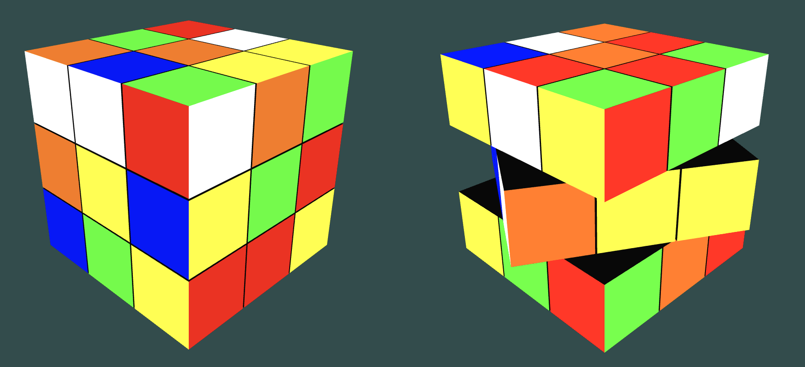

# OpenGL Rubik's Cube

A procedural 3D Rubik's Cube simulation written in modern OpenGL and C++.

## Demo

This project began as an OpenGL learning exercise and evolved into a simple Rubik’s Cube engine featuring:

- 27 independently rendered cubelets
- Layer-based cube rotations
- Generic axis/layer/direction move system
- Persistent cubelet orientation tracking
- Smooth animated 90-degree turns
- Randomized cube rotations
- Modern OpenGL rendering pipeline using GLFW, GLAD, and GLM

## Technologies

- C++
- OpenGL 4.1 Core
- GLFW
- GLAD
- GLM
- CMake
- Ninja

## Build Instructions

### macOS

Requires:
- CMake
- Ninja
- GLFW
- Clang

Configure and build:

rm -rf build

cmake -S . -B build -G Ninja \
  -DCMAKE_BUILD_TYPE=Debug \
  -DCMAKE_C_COMPILER=clang \
  -DCMAKE_CXX_COMPILER=clang++

cmake --build build

./build/rubiks_cube

Current Features
- Procedurally generated cubelets
- Generic move abstraction (Axis, Move)
- Per-cubelet transform state
- Rotation commit system
- Randomized cube rotations
- Frame-rate independent animation

Planned Features
- Proper Rubik’s Cube face coloring
- Black internal cubelet faces
- Camera controls
- Move history / undo system
- Scramble generation
- Solver integration
- Experimental LLM-assisted solving agent
